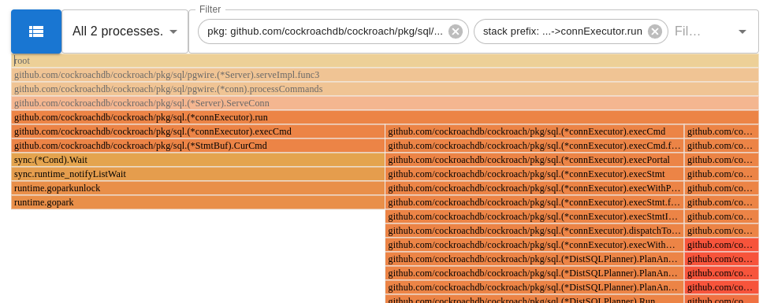
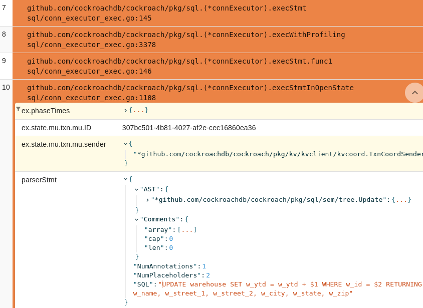
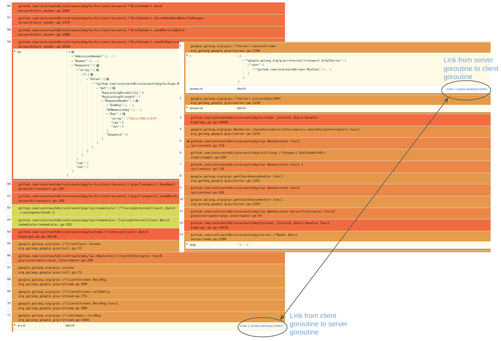

# Ex-Ray - a cloud-native debugger for production Golang systems
###### Ask your production software anything

Ex-Ray, from Data Ex Machina, is a new-generation debugger for engineers that
care about mission-critical systems running in production. Using Ex-Ray is free.

In the shift towards cloud computing and micro-services, we have lost an
essential development and support tool – the debugger. Debuggers are great for
desktop software but don’t quite apply to cloud software (programs run on
many machines, not just one; processes cannot be “paused” for any measurable
amount of time and certainly a human cannot be in the loop while a process is
stopped, no single person understands all the code of complex systems, etc.).
At the same time, software has been getting ever more complex; now we need
advanced observability tooling more than ever. We don’t have to throw out the
baby with the bathwater. Ex-Ray is designed to work for modern cloud software
running in production. It aims to make debugging pleasant and exciting by
bringing back the ability to “ask your software anything”.

Ex-Ray consists of an agent that runs on every machine hosting processes that
need monitoring, and a hosted service that stores and processes data collected
by the agents. Users use the debugger through a web application that gives
access to the agents installed in the different environments of the organization
(e.g. staging, production) and to all the data collected in the past. The
debugger can produce "snapshots" of the state of a distributed system,
collecting stack traces and arbitrary variables data.

Ex-Ray works by dynamically instrumenting the Go code of the monitored processes
using eBPF. No code changes are necessary; based on a specification of what to
collect and the debug information of the deployed binaries, Ex-Ray generates
eBPF probes that walk stacks, recognize interesting functions, read variables,
chase pointers, etc.

#### Features
- Collect “snapshots” of a whole distributed system
- Explore the execution state of all goroutines at a certain point in time
- Collect interesting data from stacks and heap
- Produce reports customized to your programs
- Explore related goroutines across network boundaries (e.g. trace a request across gRPC remote calls)
- Query and explore the collected data with SQL
- Present the data in Grafana dashboards

### Explore the execution state of all goroutines
Ex-Ray lets you explore the stack traces of all the goroutines running in the
snapshotted processes. You can visualize the goroutines in different ways, for
example as a flamegraph showing an aggregated view of all the goroutines.

The stack traces can be sliced and diced in different ways. For example, you can
focus on one goroutine and see variables collected from different stack frames.

### Collect interesting data from stacks and heap

The main power of Ex-Ray is in the ability to collect variables from the stack
frames of the different goroutines. This data can be explored and queried
through SQL tables.

### Navigating between related goroutines

Ex-Ray has the ability to link together frames from different goroutines (or,
more generally, different entities from the collected data). For example, an
operation holding that is currently blocked trying to acquire a lock can be
linked to the operation that is currently holding the lock. Or, a client-side
goroutine waiting on a network request can be linked to the server-side
goroutine that is handling the respective request. Following links makes
understanding the current state of intertwined actors easy and pleasant.

An example of going back and forth between a client and a server goroutine over
a gRPC request link.

### Debugging at scale

Debugging a complex system involves a team of people working over a period of
time. Ex-Ray is designed to support team collaboration. Debugging sessions do not
start with a blinking cursor; they start from a specification of what data to
collect and how to organise it that was built over time by colleagues working on
the same codebase.

This specification defines which variables/expressions are collected and from
which functions, how the collected data is refined into SQL tables, and what
entities are linked together.

### Reports

Ex-Ray aims to let users operate at different levels of abstraction. At the
lowest level, raw data can be collected. This data is explored in the context of
goroutines, stack traces and stack frames (i.e. functions). The specification of
which data to collect involves familiarity with the code – selecting functions
and variables. Each function for which some variables/expressions are collected
defines a "function" SQL table with a row for every stack frame corresponding to
the respective function being executed by some goroutine at the time of the
snapshot.

Once some data is collected, it can be further refined into new SQL tables. Such
"derived" tables are defined by SQL queries joining and aggregating data from
the base "function" tables. Rows in derived tables no longer necessarily
correspond to one stack frame, one goroutine, one function or even one process.
For example, a table can be created that lists pairs of related operations –
when monitoring a SQL database, one could define a table listing pairs for SQL
queries that are blocked on each other. Such derived tables can be thought of as
higher-level "reports" about the current state of the system as it was captured
in a snapshot. Such reports can replace "/statusz" HTTP endpoints commonly
programmed into services for debugging purposes (web pages that present some
current process-wide or cluster-wide state for debugging). Taking such
instrumentation out of the codebase, and into a dedicated debugging tool, makes
the reporting much more nimble and flexible: it can evolve on a different
schedule from the codebase (in particular, it can be changed *on the fly* as
someone needs more information).

### Grafana plugin

Taking the idea of custom reports further, we are working on a Grafana plugin
that facilitates the creation of dashboards backed by snapshot data.

## Installation
- Log into [app.exray.dev](https://app.exray.dev) with your work email
  - a personal Google account can also be used, in which case the collected data
    will be accessible only to your user, instead of it being shared with
    everyone using an email address from the same domain
- Copy your organization’s API token
  - click on your user's avatar in the top
    right corner, copy the "agent token" (verifying that the organization's domain
    name is indeed the domain of email addresses you want to share snapshot data
    with)
- Install the Ex-Ray agent on all the machines hosting processes that you want
  to monitor
  - on each machine, run `curl https://sh.exray.dev/ | sh -s - -t <tenant-token>`,
    replacing `<tenant-token>` with the organization's API token copied from the
    Ex-Ray web app.
  - the script will install the agent through a snap package. Installation uses
    `sudo`; you might need to enter your password.
  - to uninstall the agent, do `sudo snap remove --purge exray-agent`

## Future plans

TODO

## Get in touch

TODO discord, email
